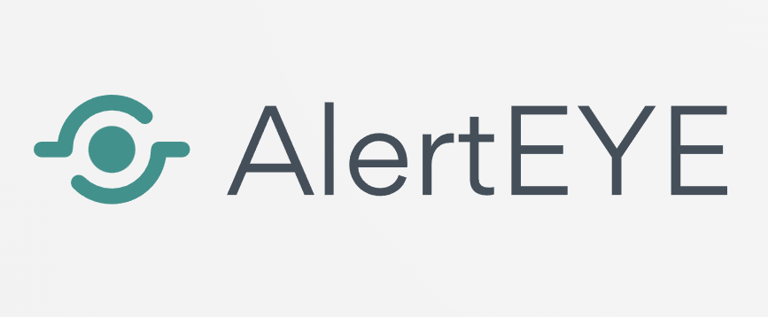
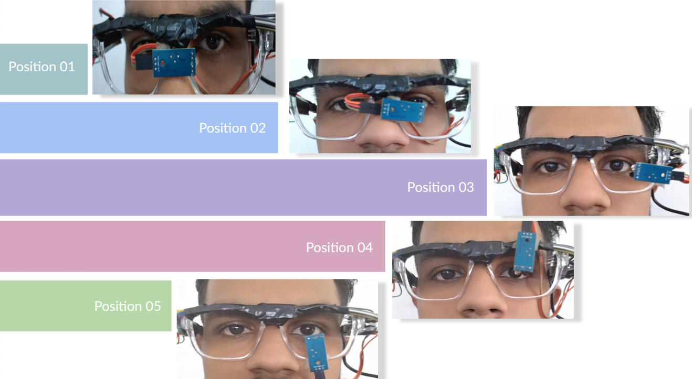
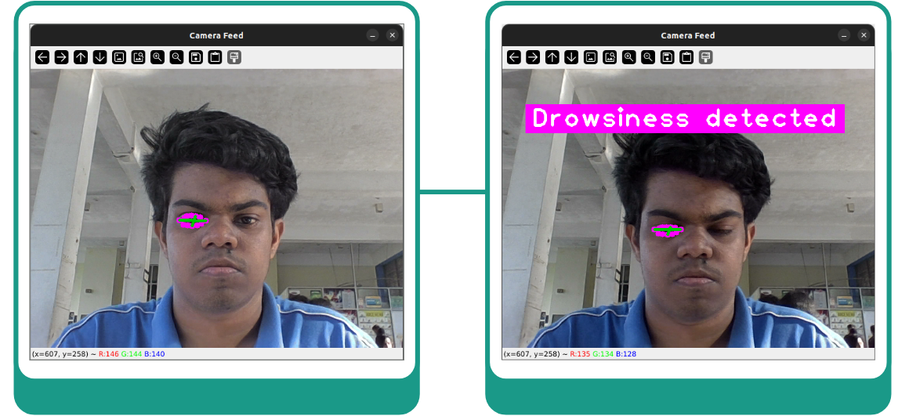

    

# AlertEYE

**AlertEYE** is a smart wearable solution designed to proactively identify and prevent road accidents caused by driver drowsiness and intoxication. Integrating real-time monitoring with a user-friendly mobile application, AlertEYE aims to enhance road safety through cutting-edge technology

## Table of Contents
* [Problem Statement](#problem-statement)
* [Solution Overview](#solution-overview)
* [Key Features](#key-features)
* [Technology Stack](#technology-stack)
* [Comparative Analysis](#comparative-analysis)
* [Benefits](#benefits)
* [Pros & Cons](#pros--cons)
* [Team](#team)

## Problem Statement
According to the World Health Organization, a life is lost every 26 seconds due to road accidents. There is a critical need for proactive prevention methods, particularly regarding incidents involving intoxicated or drowsy drivers.

## Solution Overview
The AlertEYE concept integrates smart glasses equipped with real-time driver monitoring technology to detect signs of drowsiness. The system consists of a wearable device (smart glasses) connected to a mobile application

When drowsiness is detected, the system alerts the driver, helping to prevent potential accidents. Additionally, the system optimizes fleet management by incentivizing safe driving behaviors through a rewards system

## Key Features
* **Real-Time Monitoring:** Uses IR sensors mounted on wearable glasses to monitor driver alertness.
* **Mobile Application:** A user-friendly Android app developed in Java that displays user details, ranks, and points.
* **Location Tracking:** Utilizes Google Maps API to receive location updates every 5 seconds
* **Cloud Sync:** Leverages Firebase as a cloud-hosted real-time database to store and sync application data.
* **Reward System:** Tracks total points and distance traveled, ranking users to encourage safer driving habits.

## Technology Stack

### Hardware
* **Microcontroller:** Arduino Nano (chosen for its small size and ease of handling).
* **Sensors:** IR Sensors (chosen for high sensitivity and cost-effectiveness).
* **Output:** Buzzer/Speaker (small size with high intensity for alerts).

### Software
* **IDE:** Android Studio (for app development) and Arduino IDE (for hardware code in C).
* **Languages:** Java (Android app) and C (Arduino).
* **Database:** Firebase Realtime Database
* **APIs:** Google Maps API

## Comparative Analysis
The project explored alternative solutions before selecting the wearable IR sensor approach:

<strong>Optimization Studies</strong>
 

<ul>
    <li><strong>Sensor Positioning:</strong> Studies were conducted to identify the ideal sensor position for the best vision and readings. "Position 1" yielded the highest average accuracy and viewing area compared to four other positions tested.</li>
    <li><strong>Accuracy:</strong> Comparative data shows the camera method has slightly higher accuracy than the IR sensor, but the IR sensor remains a viable, cost-effective alternative.</li>
</ul>
 

<strong>Alternative Approach: Dashcam Drowsiness Detection</strong>
 

<ul>
    <li><strong>Method:</strong> A camera mounted on the dashboard uses OpenCV and Python to detect drowsiness via facial recognition.</li>
    <li><strong>Comparison:</strong> While the camera method offers high accuracy, the AlertEYE wearable solution focuses on portability and consistent performance.</li>
</ul>
 

## Benefits
* **Safety:** Proactively detects signs of drowsiness to prevent accidents.
* **User-Friendly:** Accessible mobile app interface.
* **Sustainability:** Uses rechargeable glasses to lessen battery waste, aligning with eco-friendly trends.
* **Accessibility:** Beneficial for individuals with sleeping disorders.
* **Continuous Usage:** Rechargeable design ensures uninterrupted usage.

## Pros & Cons

**Pros**
* Portable and wearable.
* Durable hardware design.
* Consistent performance.
* User-friendly application design.

**Cons**
* Wearable form factor may not be comfortable for all users.
* Reliance on a power supply.
* Challenges in maintaining 100% drowsiness detection accuracy compared to high-end camera systems.

## Team
* **Sathindu Dhanushka** (IT23669062)  **Akith De Silva** (IT23632028)  **Sakith Abeywickrama** (IT23592674)  **Dinushka Sandeepa** (IT23736450) 